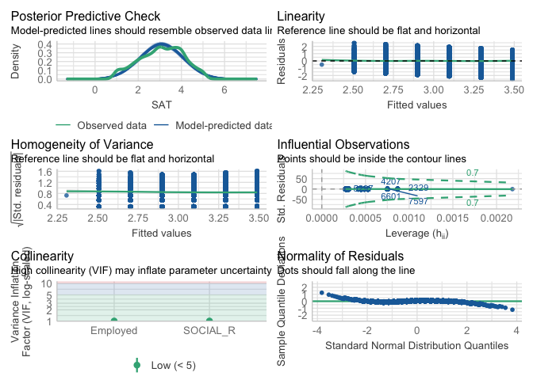
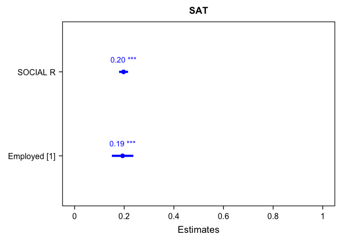
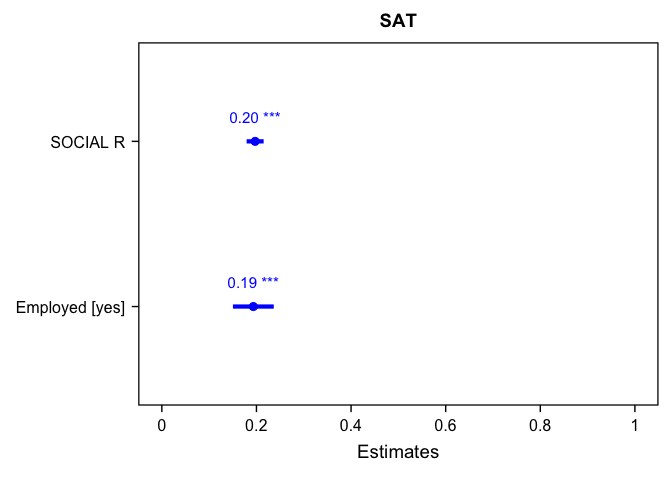

My dataset
================
Leo Lu
2024-10-10

``` r
library(haven)
library(psych)
library(dplyr)
```

    ## 
    ## Attaching package: 'dplyr'

    ## The following objects are masked from 'package:stats':
    ## 
    ##     filter, lag

    ## The following objects are masked from 'package:base':
    ## 
    ##     intersect, setdiff, setequal, union

``` r
library(ggplot2)
```

    ## 
    ## Attaching package: 'ggplot2'

    ## The following objects are masked from 'package:psych':
    ## 
    ##     %+%, alpha

``` r
library(tidyr)
library(bruceR)
```

    ## 
    ## bruceR (v2024.6)
    ## Broadly Useful Convenient and Efficient R functions
    ## 
    ## Packages also loaded:
    ## ✔ data.table ✔ emmeans
    ## ✔ dplyr      ✔ lmerTest
    ## ✔ tidyr      ✔ effectsize
    ## ✔ stringr    ✔ performance
    ## ✔ ggplot2    ✔ interactions
    ## 
    ## Main functions of `bruceR`:
    ## cc()             Describe()  TTEST()
    ## add()            Freq()      MANOVA()
    ## .mean()          Corr()      EMMEANS()
    ## set.wd()         Alpha()     PROCESS()
    ## import()         EFA()       model_summary()
    ## print_table()    CFA()       lavaan_summary()
    ## 
    ## For full functionality, please install all dependencies:
    ## install.packages("bruceR", dep=TRUE)
    ## 
    ## Online documentation:
    ## https://psychbruce.github.io/bruceR
    ## 
    ## To use this package in publications, please cite:
    ## Bao, H.-W.-S. (2024). bruceR: Broadly useful convenient and efficient R functions (Version 2024.6) [Computer software]. https://CRAN.R-project.org/package=bruceR

    ## 
    ## These packages are dependencies of `bruceR` but not installed:
    ## - pacman, openxlsx, ggtext, lmtest, vars, phia, MuMIn, GGally
    ## 
    ## ***** Install all dependencies *****
    ## install.packages("bruceR", dep=TRUE)

``` r
library(ggsci)
library(see)
```

    ## 
    ## Attaching package: 'see'

    ## The following objects are masked from 'package:ggsci':
    ## 
    ##     scale_color_material, scale_colour_material, scale_fill_material

``` r
library(car)
```

    ## Loading required package: carData

    ## 
    ## Attaching package: 'car'

    ## The following object is masked from 'package:dplyr':
    ## 
    ##     recode

    ## The following object is masked from 'package:psych':
    ## 
    ##     logit

``` r
library(ggstatsplot)
```

    ## You can cite this package as:
    ##      Patil, I. (2021). Visualizations with statistical details: The 'ggstatsplot' approach.
    ##      Journal of Open Source Software, 6(61), 3167, doi:10.21105/joss.03167

``` r
library(performance)
library(sjPlot)
```

    ## Install package "strengejacke" from GitHub (`devtools::install_github("strengejacke/strengejacke")`) to load all sj-packages at once!

``` r
load("/Users/leolu/Documents/38964-0001-Data.rda")
```

``` r
mydataset <- da38964.0001 %>%
  select(SAT1, SAT2, SAT3, SAT4, SAT5, EMP_1, EMP_2, HAPPY, SOCIAL_2, AGE, WORK_HRS, SLEEPHRS,)

mydataset$SAT1 <- as.numeric(mydataset$SAT1)

describe(mydataset$SAT1)
```

    ##    vars    n mean   sd median trimmed  mad min max range  skew kurtosis   se
    ## X1    1 7644 3.03 1.19      3    3.06 1.48   1   7     6 -0.22    -0.91 0.01

``` r
mydataset <- mydataset %>%
  filter(SAT1 < 6)

summary(mydataset$SAT1)
```

    ##    Min. 1st Qu.  Median    Mean 3rd Qu.    Max. 
    ##    1.00    2.00    3.00    3.03    4.00    5.00

``` r
mydataset$SAT2 <- as.numeric(mydataset$SAT2)

describe(mydataset$SAT2)
```

    ##    vars    n mean   sd median trimmed  mad min max range  skew kurtosis   se
    ## X1    1 7640 3.04 1.19      3    3.05 1.48   1   7     6 -0.16    -0.95 0.01

``` r
mydataset <- mydataset %>%
  filter(SAT2 < 6)

summary(mydataset$SAT2)
```

    ##    Min. 1st Qu.  Median    Mean 3rd Qu.    Max. 
    ##   1.000   2.000   3.000   3.037   4.000   5.000

``` r
mydataset$SAT3 <- as.numeric(mydataset$SAT3)

describe(mydataset$SAT3)
```

    ##    vars    n mean   sd median trimmed  mad min max range  skew kurtosis   se
    ## X1    1 7639 3.27 1.24      4    3.33 1.48   1   7     6 -0.35    -0.95 0.01

``` r
mydataset <- mydataset %>%
  filter(SAT3 < 6)

summary(mydataset$SAT3)
```

    ##    Min. 1st Qu.  Median    Mean 3rd Qu.    Max. 
    ##   1.000   2.000   4.000   3.266   4.000   5.000

``` r
mydataset$SAT4 <- as.numeric(mydataset$SAT4)

describe(mydataset$SAT4)
```

    ##    vars    n mean   sd median trimmed  mad min max range  skew kurtosis   se
    ## X1    1 7638 3.36 1.21      4    3.44 1.48   1   5     4 -0.44    -0.81 0.01

``` r
mydataset <- mydataset %>%
  filter(SAT4 < 6)

summary(mydataset$SAT4)
```

    ##    Min. 1st Qu.  Median    Mean 3rd Qu.    Max. 
    ##   1.000   2.000   4.000   3.364   4.000   5.000

``` r
mydataset$SAT5 <- as.numeric(mydataset$SAT5)

describe(mydataset$SAT5)
```

    ##    vars    n mean   sd median trimmed  mad min max range skew kurtosis   se
    ## X1    1 7638 2.72 1.33      3    2.65 1.48   1   7     6 0.25    -1.13 0.02

``` r
mydataset <- mydataset %>%
  filter(SAT5 < 6)

summary(mydataset$SAT5)
```

    ##    Min. 1st Qu.  Median    Mean 3rd Qu.    Max. 
    ##   1.000   2.000   3.000   2.721   4.000   5.000

``` r
describe(mydataset$SAT5)
```

    ##    vars    n mean   sd median trimmed  mad min max range skew kurtosis   se
    ## X1    1 7637 2.72 1.33      3    2.65 1.48   1   5     4 0.25    -1.14 0.02

``` r
mydataset <- mydataset %>%
  mutate(SAT = rowMeans(cbind(SAT1, SAT2, SAT3, SAT4, SAT5)))

mydataset$SOCIAL_2 <- as.numeric(mydataset$SOCIAL_2)

describe(mydataset$SOCIAL_2)
```

    ##    vars    n mean  sd median trimmed  mad min max range skew kurtosis   se
    ## X1    1 7637 2.56 1.2      3    2.49 1.48   1   7     6 0.35    -0.73 0.01

``` r
mydataset %>% count(SOCIAL_2)
```

    ##   SOCIAL_2    n
    ## 1        1 1765
    ## 2        2 2016
    ## 3        3 2216
    ## 4        4 1066
    ## 5        5  573
    ## 6        7    1

``` r
mydataset$SOCIAL_R <- 5 - mydataset$SOCIAL_2

mydataset %>% count(SOCIAL_R)
```

    ##   SOCIAL_R    n
    ## 1       -2    1
    ## 2        0  573
    ## 3        1 1066
    ## 4        2 2216
    ## 5        3 2016
    ## 6        4 1765

``` r
summary(mydataset$SOCIAL_R)
```

    ##    Min. 1st Qu.  Median    Mean 3rd Qu.    Max. 
    ##  -2.000   2.000   2.000   2.436   3.000   4.000

``` r
describe(mydataset$SOCIAL_R)
```

    ##    vars    n mean  sd median trimmed  mad min max range  skew kurtosis   se
    ## X1    1 7637 2.44 1.2      2    2.51 1.48  -2   4     6 -0.35    -0.73 0.01

``` r
mydataset$HAPPY <- as.numeric(mydataset$HAPPY)

describe(mydataset$HAPPY)
```

    ##    vars    n mean   sd median trimmed mad min max range skew kurtosis   se
    ## X1    1 7637 1.98 0.73      2    1.94   0   1   4     3 0.45     0.06 0.01

``` r
mydataset <- mydataset %>%
  filter(HAPPY < 5)

summary(mydataset$HAPPY)
```

    ##    Min. 1st Qu.  Median    Mean 3rd Qu.    Max. 
    ##    1.00    1.00    2.00    1.98    2.00    4.00

``` r
describe(mydataset$HAPPY)
```

    ##    vars    n mean   sd median trimmed mad min max range skew kurtosis   se
    ## X1    1 7637 1.98 0.73      2    1.94   0   1   4     3 0.45     0.06 0.01

``` r
mydataset <- mydataset %>%
  filter(EMP_1 != "(99) Refusal")

mydataset <- mydataset %>%
  mutate_at(c('EMP_1'),funs(str_replace(., "(00) Item not selected", "Not in One Job")))
```

    ## Warning: `funs()` was deprecated in dplyr 0.8.0.
    ## ℹ Please use a list of either functions or lambdas:
    ## 
    ## # Simple named list: list(mean = mean, median = median)
    ## 
    ## # Auto named with `tibble::lst()`: tibble::lst(mean, median)
    ## 
    ## # Using lambdas list(~ mean(., trim = .2), ~ median(., na.rm = TRUE))
    ## Call `lifecycle::last_lifecycle_warnings()` to see where this warning was
    ## generated.

``` r
mydataset <- mydataset %>%  
  mutate_at(c('EMP_1'),funs(str_replace(., "(01) Item selected", "One Job")))
```

    ## Warning: `funs()` was deprecated in dplyr 0.8.0.
    ## ℹ Please use a list of either functions or lambdas:
    ## 
    ## # Simple named list: list(mean = mean, median = median)
    ## 
    ## # Auto named with `tibble::lst()`: tibble::lst(mean, median)
    ## 
    ## # Using lambdas list(~ mean(., trim = .2), ~ median(., na.rm = TRUE))
    ## Call `lifecycle::last_lifecycle_warnings()` to see where this warning was
    ## generated.

``` r
  summary(mydataset$EMP_1)
```

    ##    Length     Class      Mode 
    ##      7636 character character

``` r
mydataset <- mydataset %>%
  filter(EMP_2 != "(99) Refusal")

mydataset<- mydataset%>%
  mutate_at(c('EMP_2'),funs(str_replace(., "(00) Item not selected", "Not in Multiple Jobs")))
```

    ## Warning: `funs()` was deprecated in dplyr 0.8.0.
    ## ℹ Please use a list of either functions or lambdas:
    ## 
    ## # Simple named list: list(mean = mean, median = median)
    ## 
    ## # Auto named with `tibble::lst()`: tibble::lst(mean, median)
    ## 
    ## # Using lambdas list(~ mean(., trim = .2), ~ median(., na.rm = TRUE))
    ## Call `lifecycle::last_lifecycle_warnings()` to see where this warning was
    ## generated.

``` r
mydataset<- mydataset%>%
  mutate_at(c('EMP_2'),funs(str_replace(., "(01) Item selected", "Multiple Jobs")))
```

    ## Warning: `funs()` was deprecated in dplyr 0.8.0.
    ## ℹ Please use a list of either functions or lambdas:
    ## 
    ## # Simple named list: list(mean = mean, median = median)
    ## 
    ## # Auto named with `tibble::lst()`: tibble::lst(mean, median)
    ## 
    ## # Using lambdas list(~ mean(., trim = .2), ~ median(., na.rm = TRUE))
    ## Call `lifecycle::last_lifecycle_warnings()` to see where this warning was
    ## generated.

``` r
summary(mydataset$EMP_2)
```

    ##    Length     Class      Mode 
    ##      7636 character character

``` r
Corr(mydataset)
```

    ## Warning in Corr(mydataset): NAs introduced by coercion
    ## Warning in Corr(mydataset): NAs introduced by coercion

    ## Warning in sqrt(n - 2): NaNs produced

    ## Warning in psych::corr.test(data.new, method = method, adjust = p.adjust, :
    ## Number of subjects must be greater than 3 to find confidence intervals.

    ## Warning in sqrt(n[lower.tri(n)] - 3): NaNs produced

    ## NOTE: `EMP_1`, `EMP_2`, `WORK_HRS` transformed to numeric.
    ## 
    ## Pearson's r and 95% confidence intervals:
    ## ──────────────────────────────────────────────────────
    ##                        r       [95% CI]     p        N
    ## ──────────────────────────────────────────────────────
    ## SAT1-SAT2           0.69 [ 0.68,  0.70] <.001 *** 7636
    ## SAT1-SAT3           0.68 [ 0.67,  0.69] <.001 *** 7636
    ## SAT1-SAT4           0.56 [ 0.55,  0.58] <.001 *** 7636
    ## SAT1-SAT5           0.45 [ 0.44,  0.47] <.001 *** 7636
    ## SAT1-EMP_1               [   NA,    NA]              0
    ## SAT1-EMP_2               [   NA,    NA]              0
    ## SAT1-HAPPY         -0.52 [-0.54, -0.51] <.001 *** 7636
    ## SAT1-SOCIAL_2      -0.20 [-0.22, -0.18] <.001 *** 7636
    ## SAT1-AGE            0.03 [ 0.01,  0.05]  .010 *   7636
    ## SAT1-WORK_HRS      -0.08 [-0.10, -0.05] <.001 *** 7636
    ## SAT1-SLEEPHRS       0.02 [-0.01,  0.04]  .138     7636
    ## SAT1-SAT            0.83 [ 0.83,  0.84] <.001 *** 7636
    ## SAT1-SOCIAL_R       0.20 [ 0.18,  0.22] <.001 *** 7636
    ## SAT2-SAT3           0.70 [ 0.69,  0.71] <.001 *** 7636
    ## SAT2-SAT4           0.55 [ 0.53,  0.56] <.001 *** 7636
    ## SAT2-SAT5           0.45 [ 0.43,  0.47] <.001 *** 7636
    ## SAT2-EMP_1               [   NA,    NA]              0
    ## SAT2-EMP_2               [   NA,    NA]              0
    ## SAT2-HAPPY         -0.53 [-0.55, -0.52] <.001 *** 7636
    ## SAT2-SOCIAL_2      -0.23 [-0.25, -0.21] <.001 *** 7636
    ## SAT2-AGE           -0.04 [-0.06, -0.02] <.001 *** 7636
    ## SAT2-WORK_HRS      -0.09 [-0.11, -0.07] <.001 *** 7636
    ## SAT2-SLEEPHRS       0.01 [-0.01,  0.04]  .263     7636
    ## SAT2-SAT            0.83 [ 0.83,  0.84] <.001 *** 7636
    ## SAT2-SOCIAL_R       0.23 [ 0.21,  0.25] <.001 *** 7636
    ## SAT3-SAT4           0.63 [ 0.62,  0.65] <.001 *** 7636
    ## SAT3-SAT5           0.48 [ 0.47,  0.50] <.001 *** 7636
    ## SAT3-EMP_1               [   NA,    NA]              0
    ## SAT3-EMP_2               [   NA,    NA]              0
    ## SAT3-HAPPY         -0.58 [-0.60, -0.57] <.001 *** 7636
    ## SAT3-SOCIAL_2      -0.25 [-0.27, -0.23] <.001 *** 7636
    ## SAT3-AGE            0.03 [ 0.00,  0.05]  .017 *   7636
    ## SAT3-WORK_HRS      -0.09 [-0.11, -0.07] <.001 *** 7636
    ## SAT3-SLEEPHRS       0.02 [-0.01,  0.04]  .161     7636
    ## SAT3-SAT            0.87 [ 0.86,  0.87] <.001 *** 7636
    ## SAT3-SOCIAL_R       0.25 [ 0.23,  0.27] <.001 *** 7636
    ## SAT4-SAT5           0.45 [ 0.43,  0.46] <.001 *** 7636
    ## SAT4-EMP_1               [   NA,    NA]              0
    ## SAT4-EMP_2               [   NA,    NA]              0
    ## SAT4-HAPPY         -0.44 [-0.46, -0.42] <.001 *** 7636
    ## SAT4-SOCIAL_2      -0.20 [-0.22, -0.18] <.001 *** 7636
    ## SAT4-AGE            0.07 [ 0.05,  0.10] <.001 *** 7636
    ## SAT4-WORK_HRS      -0.06 [-0.08, -0.03] <.001 *** 7636
    ## SAT4-SLEEPHRS       0.01 [-0.02,  0.03]  .621     7636
    ## SAT4-SAT            0.79 [ 0.78,  0.80] <.001 *** 7636
    ## SAT4-SOCIAL_R       0.20 [ 0.18,  0.22] <.001 *** 7636
    ## SAT5-EMP_1               [   NA,    NA]              0
    ## SAT5-EMP_2               [   NA,    NA]              0
    ## SAT5-HAPPY         -0.38 [-0.40, -0.36] <.001 *** 7636
    ## SAT5-SOCIAL_2      -0.14 [-0.16, -0.12] <.001 *** 7636
    ## SAT5-AGE           -0.00 [-0.03,  0.02]  .765     7636
    ## SAT5-WORK_HRS      -0.04 [-0.06, -0.01]  .001 **  7636
    ## SAT5-SLEEPHRS       0.04 [ 0.01,  0.06]  .001 **  7636
    ## SAT5-SAT            0.71 [ 0.70,  0.73] <.001 *** 7636
    ## SAT5-SOCIAL_R       0.14 [ 0.12,  0.16] <.001 *** 7636
    ## EMP_1-EMP_2              [   NA,    NA]              0
    ## EMP_1-HAPPY              [   NA,    NA]              0
    ## EMP_1-SOCIAL_2           [   NA,    NA]              0
    ## EMP_1-AGE                [   NA,    NA]              0
    ## EMP_1-WORK_HRS           [   NA,    NA]              0
    ## EMP_1-SLEEPHRS           [   NA,    NA]              0
    ## EMP_1-SAT                [   NA,    NA]              0
    ## EMP_1-SOCIAL_R           [   NA,    NA]              0
    ## EMP_2-HAPPY              [   NA,    NA]              0
    ## EMP_2-SOCIAL_2           [   NA,    NA]              0
    ## EMP_2-AGE                [   NA,    NA]              0
    ## EMP_2-WORK_HRS           [   NA,    NA]              0
    ## EMP_2-SLEEPHRS           [   NA,    NA]              0
    ## EMP_2-SAT                [   NA,    NA]              0
    ## EMP_2-SOCIAL_R           [   NA,    NA]              0
    ## HAPPY-SOCIAL_2      0.23 [ 0.21,  0.25] <.001 *** 7636
    ## HAPPY-AGE           0.02 [-0.01,  0.04]  .163     7636
    ## HAPPY-WORK_HRS      0.08 [ 0.05,  0.10] <.001 *** 7636
    ## HAPPY-SLEEPHRS     -0.03 [-0.06, -0.01]  .004 **  7636
    ## HAPPY-SAT          -0.61 [-0.62, -0.59] <.001 *** 7636
    ## HAPPY-SOCIAL_R     -0.23 [-0.25, -0.21] <.001 *** 7636
    ## SOCIAL_2-AGE        0.08 [ 0.06,  0.11] <.001 *** 7636
    ## SOCIAL_2-WORK_HRS   0.09 [ 0.07,  0.11] <.001 *** 7636
    ## SOCIAL_2-SLEEPHRS   0.01 [-0.01,  0.04]  .197     7636
    ## SOCIAL_2-SAT       -0.25 [-0.27, -0.23] <.001 *** 7636
    ## SOCIAL_2-SOCIAL_R  -1.00 [-1.00, -1.00] <.001 *** 7636
    ## AGE-WORK_HRS        0.15 [ 0.13,  0.17] <.001 *** 7636
    ## AGE-SLEEPHRS       -0.02 [-0.05, -0.00]  .034 *   7636
    ## AGE-SAT             0.02 [-0.00,  0.04]  .058 .   7636
    ## AGE-SOCIAL_R       -0.08 [-0.11, -0.06] <.001 *** 7636
    ## WORK_HRS-SLEEPHRS   0.02 [-0.00,  0.04]  .121     7636
    ## WORK_HRS-SAT       -0.09 [-0.11, -0.06] <.001 *** 7636
    ## WORK_HRS-SOCIAL_R  -0.09 [-0.11, -0.07] <.001 *** 7636
    ## SLEEPHRS-SAT        0.02 [ 0.00,  0.04]  .049 *   7636
    ## SLEEPHRS-SOCIAL_R  -0.01 [-0.04,  0.01]  .197     7636
    ## SAT-SOCIAL_R        0.25 [ 0.23,  0.27] <.001 *** 7636
    ## ──────────────────────────────────────────────────────

<!-- -->

    ## Correlation matrix is displayed in the RStudio `Plots` Pane.

``` r
mydataset$Employed <- ifelse(mydataset$EMP_1 == "(01) Item selected" | mydataset$EMP_2 == "(01) Item selected", "yes", "no")

model<-lm(SAT ~ SOCIAL_R + Employed, data = mydataset)

performance(model)
```

    ## # Indices of model performance
    ## 
    ## AIC       |      AICc |       BIC |    R2 | R2 (adj.) |  RMSE | Sigma
    ## ---------------------------------------------------------------------
    ## 20992.901 | 20992.906 | 21020.664 | 0.072 |     0.071 | 0.956 | 0.956

``` r
check_model(model)
```

<!-- -->

``` r
model_summary(model)
```

    ## 
    ## Model Summary
    ## 
    ## ─────────────────────────
    ##              (1) SAT     
    ## ─────────────────────────
    ## (Intercept)     2.506 ***
    ##                (0.026)   
    ## SOCIAL_R        0.197 ***
    ##                (0.009)   
    ## Employedyes     0.193 ***
    ##                (0.022)   
    ## ─────────────────────────
    ## R^2             0.072    
    ## Adj. R^2        0.071    
    ## Num. obs.    7636        
    ## ─────────────────────────
    ## Note. * p < .05, ** p < .01, *** p < .001.
    ## 
    ## # Check for Multicollinearity
    ## 
    ## Low Correlation
    ## 
    ##      Term  VIF   VIF 95% CI Increased SE Tolerance Tolerance 95% CI
    ##  SOCIAL_R 1.01 [1.00, 1.08]         1.01      0.99     [0.93, 1.00]
    ##  Employed 1.01 [1.00, 1.08]         1.01      0.99     [0.93, 1.00]

``` r
tab_model(model)
```

<table style="border-collapse:collapse; border:none;">
<tr>
<th style="border-top: double; text-align:center; font-style:normal; font-weight:bold; padding:0.2cm;  text-align:left; ">
 
</th>
<th colspan="3" style="border-top: double; text-align:center; font-style:normal; font-weight:bold; padding:0.2cm; ">
SAT
</th>
</tr>
<tr>
<td style=" text-align:center; border-bottom:1px solid; font-style:italic; font-weight:normal;  text-align:left; ">
Predictors
</td>
<td style=" text-align:center; border-bottom:1px solid; font-style:italic; font-weight:normal;  ">
Estimates
</td>
<td style=" text-align:center; border-bottom:1px solid; font-style:italic; font-weight:normal;  ">
CI
</td>
<td style=" text-align:center; border-bottom:1px solid; font-style:italic; font-weight:normal;  ">
p
</td>
</tr>
<tr>
<td style=" padding:0.2cm; text-align:left; vertical-align:top; text-align:left; ">
(Intercept)
</td>
<td style=" padding:0.2cm; text-align:left; vertical-align:top; text-align:center;  ">
2.51
</td>
<td style=" padding:0.2cm; text-align:left; vertical-align:top; text-align:center;  ">
2.45 – 2.56
</td>
<td style=" padding:0.2cm; text-align:left; vertical-align:top; text-align:center;  ">
<strong>\<0.001</strong>
</td>
</tr>
<tr>
<td style=" padding:0.2cm; text-align:left; vertical-align:top; text-align:left; ">
SOCIAL R
</td>
<td style=" padding:0.2cm; text-align:left; vertical-align:top; text-align:center;  ">
0.20
</td>
<td style=" padding:0.2cm; text-align:left; vertical-align:top; text-align:center;  ">
0.18 – 0.22
</td>
<td style=" padding:0.2cm; text-align:left; vertical-align:top; text-align:center;  ">
<strong>\<0.001</strong>
</td>
</tr>
<tr>
<td style=" padding:0.2cm; text-align:left; vertical-align:top; text-align:left; ">
Employed \[yes\]
</td>
<td style=" padding:0.2cm; text-align:left; vertical-align:top; text-align:center;  ">
0.19
</td>
<td style=" padding:0.2cm; text-align:left; vertical-align:top; text-align:center;  ">
0.15 – 0.24
</td>
<td style=" padding:0.2cm; text-align:left; vertical-align:top; text-align:center;  ">
<strong>\<0.001</strong>
</td>
</tr>
<tr>
<td style=" padding:0.2cm; text-align:left; vertical-align:top; text-align:left; padding-top:0.1cm; padding-bottom:0.1cm; border-top:1px solid;">
Observations
</td>
<td style=" padding:0.2cm; text-align:left; vertical-align:top; padding-top:0.1cm; padding-bottom:0.1cm; text-align:left; border-top:1px solid;" colspan="3">
7636
</td>
</tr>
<tr>
<td style=" padding:0.2cm; text-align:left; vertical-align:top; text-align:left; padding-top:0.1cm; padding-bottom:0.1cm;">
R<sup>2</sup> / R<sup>2</sup> adjusted
</td>
<td style=" padding:0.2cm; text-align:left; vertical-align:top; padding-top:0.1cm; padding-bottom:0.1cm; text-align:left;" colspan="3">
0.072 / 0.071
</td>
</tr>
</table>

``` r
plot_model(model,  type ="est",  show.values = TRUE, vline.color = "#1B191999", line.size = 1.5, dot.size = 2.5, colors = "blue") + theme_bruce()
```

<!-- -->

``` r
#Higher score of social interaction means more Social interaction, Employed yes means employed.
#7.1 % of the variability is explained by the whole model.One unit increase in Social interaction frequency means a 0.197 increase in Satisfaction With life. Being employed means a 0.194 increase in satisfaction with life.
```
