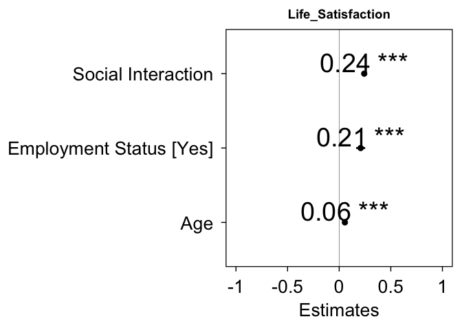
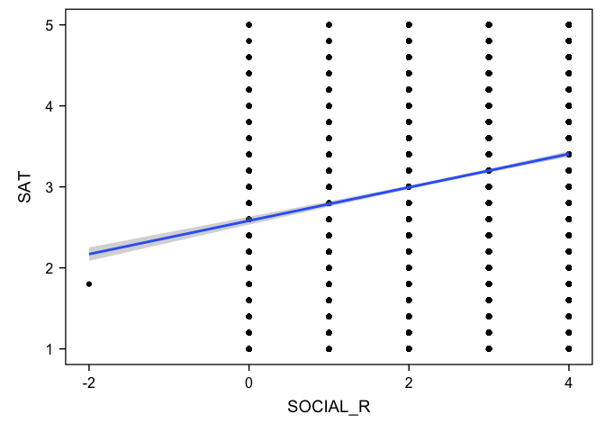
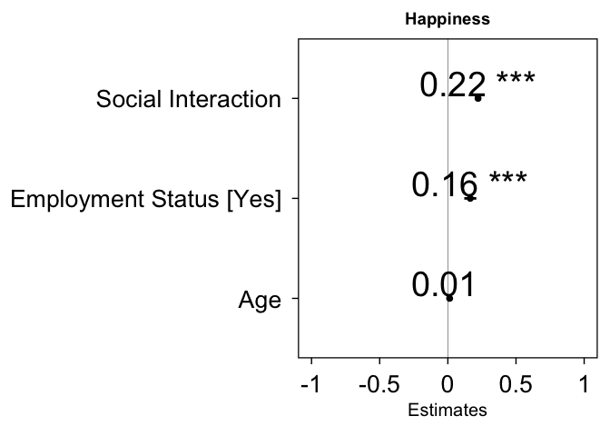
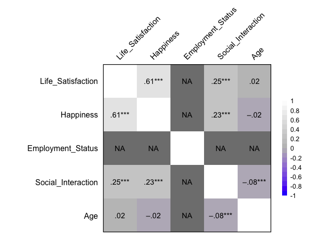
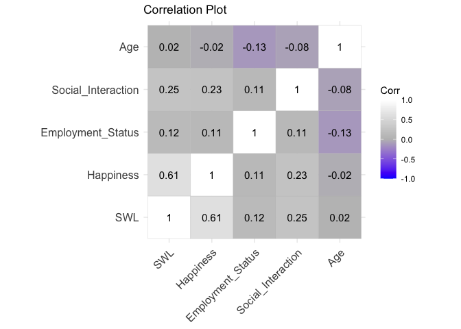

My dataset
================
Leo Lu
2024-10-10

``` r
library(haven)
library(psych)
library(dplyr)
```

    ## 
    ## Attaching package: 'dplyr'

    ## The following objects are masked from 'package:stats':
    ## 
    ##     filter, lag

    ## The following objects are masked from 'package:base':
    ## 
    ##     intersect, setdiff, setequal, union

``` r
library(ggplot2)
```

    ## 
    ## Attaching package: 'ggplot2'

    ## The following objects are masked from 'package:psych':
    ## 
    ##     %+%, alpha

``` r
library(tidyr)
library(bruceR)
```

    ## 
    ## bruceR (v2024.6)
    ## Broadly Useful Convenient and Efficient R functions
    ## 
    ## Packages also loaded:
    ## ✔ data.table ✔ emmeans
    ## ✔ dplyr      ✔ lmerTest
    ## ✔ tidyr      ✔ effectsize
    ## ✔ stringr    ✔ performance
    ## ✔ ggplot2    ✔ interactions
    ## 
    ## Main functions of `bruceR`:
    ## cc()             Describe()  TTEST()
    ## add()            Freq()      MANOVA()
    ## .mean()          Corr()      EMMEANS()
    ## set.wd()         Alpha()     PROCESS()
    ## import()         EFA()       model_summary()
    ## print_table()    CFA()       lavaan_summary()
    ## 
    ## For full functionality, please install all dependencies:
    ## install.packages("bruceR", dep=TRUE)
    ## 
    ## Online documentation:
    ## https://psychbruce.github.io/bruceR
    ## 
    ## To use this package in publications, please cite:
    ## Bao, H.-W.-S. (2024). bruceR: Broadly useful convenient and efficient R functions (Version 2024.6) [Computer software]. https://CRAN.R-project.org/package=bruceR

    ## 
    ## These packages are dependencies of `bruceR` but not installed:
    ## - pacman, openxlsx, ggtext, lmtest, vars, phia, MuMIn, GGally
    ## 
    ## ***** Install all dependencies *****
    ## install.packages("bruceR", dep=TRUE)

``` r
library(ggsci)
library(see)
```

    ## 
    ## Attaching package: 'see'

    ## The following objects are masked from 'package:ggsci':
    ## 
    ##     scale_color_material, scale_colour_material, scale_fill_material

``` r
library(car)
```

    ## Loading required package: carData

    ## 
    ## Attaching package: 'car'

    ## The following object is masked from 'package:dplyr':
    ## 
    ##     recode

    ## The following object is masked from 'package:psych':
    ## 
    ##     logit

``` r
library(ggstatsplot)
```

    ## You can cite this package as:
    ##      Patil, I. (2021). Visualizations with statistical details: The 'ggstatsplot' approach.
    ##      Journal of Open Source Software, 6(61), 3167, doi:10.21105/joss.03167

``` r
library(performance)
library(sjPlot)
```

    ## Install package "strengejacke" from GitHub (`devtools::install_github("strengejacke/strengejacke")`) to load all sj-packages at once!

``` r
library(tidyverse)
```

    ## ── Attaching core tidyverse packages ──────────────────────── tidyverse 2.0.0 ──
    ## ✔ forcats   1.0.0     ✔ readr     2.1.5
    ## ✔ lubridate 1.9.3     ✔ tibble    3.2.1
    ## ✔ purrr     1.0.2

    ## ── Conflicts ────────────────────────────────────────── tidyverse_conflicts() ──
    ## ✖ ggplot2::%+%()        masks psych::%+%()
    ## ✖ ggplot2::alpha()      masks psych::alpha()
    ## ✖ data.table::between() masks dplyr::between()
    ## ✖ Matrix::expand()      masks tidyr::expand()
    ## ✖ dplyr::filter()       masks stats::filter()
    ## ✖ data.table::first()   masks dplyr::first()
    ## ✖ lubridate::hour()     masks data.table::hour()
    ## ✖ lubridate::isoweek()  masks data.table::isoweek()
    ## ✖ dplyr::lag()          masks stats::lag()
    ## ✖ data.table::last()    masks dplyr::last()
    ## ✖ lubridate::mday()     masks data.table::mday()
    ## ✖ lubridate::minute()   masks data.table::minute()
    ## ✖ lubridate::month()    masks data.table::month()
    ## ✖ Matrix::pack()        masks tidyr::pack()
    ## ✖ lubridate::quarter()  masks data.table::quarter()
    ## ✖ car::recode()         masks dplyr::recode()
    ## ✖ lubridate::second()   masks data.table::second()
    ## ✖ purrr::some()         masks car::some()
    ## ✖ purrr::transpose()    masks data.table::transpose()
    ## ✖ Matrix::unpack()      masks tidyr::unpack()
    ## ✖ lubridate::wday()     masks data.table::wday()
    ## ✖ lubridate::week()     masks data.table::week()
    ## ✖ lubridate::yday()     masks data.table::yday()
    ## ✖ lubridate::year()     masks data.table::year()
    ## ℹ Use the conflicted package (<http://conflicted.r-lib.org/>) to force all conflicts to become errors

``` r
library(ggcorrplot)


load("/Users/leolu/Documents/38964-0001-Data.rda")
```

``` r
mydataset <- da38964.0001 %>%
  select(SAT1, SAT2, SAT3, SAT4, SAT5, EMP_1, EMP_2, HAPPY, SOCIAL_2, AGE, WORK_HRS, SLEEPHRS,)

mydataset$SAT1 <- as.numeric(mydataset$SAT1)

describe(mydataset$SAT1)
```

    ##    vars    n mean   sd median trimmed  mad min max range  skew kurtosis   se
    ## X1    1 7644 3.03 1.19      3    3.06 1.48   1   7     6 -0.22    -0.91 0.01

``` r
mydataset <- mydataset %>%
  filter(SAT1 < 6)

summary(mydataset$SAT1)
```

    ##    Min. 1st Qu.  Median    Mean 3rd Qu.    Max. 
    ##    1.00    2.00    3.00    3.03    4.00    5.00

``` r
mydataset$SAT2 <- as.numeric(mydataset$SAT2)

describe(mydataset$SAT2)
```

    ##    vars    n mean   sd median trimmed  mad min max range  skew kurtosis   se
    ## X1    1 7640 3.04 1.19      3    3.05 1.48   1   7     6 -0.16    -0.95 0.01

``` r
mydataset <- mydataset %>%
  filter(SAT2 < 6)

summary(mydataset$SAT2)
```

    ##    Min. 1st Qu.  Median    Mean 3rd Qu.    Max. 
    ##   1.000   2.000   3.000   3.037   4.000   5.000

``` r
mydataset$SAT3 <- as.numeric(mydataset$SAT3)

describe(mydataset$SAT3)
```

    ##    vars    n mean   sd median trimmed  mad min max range  skew kurtosis   se
    ## X1    1 7639 3.27 1.24      4    3.33 1.48   1   7     6 -0.35    -0.95 0.01

``` r
mydataset <- mydataset %>%
  filter(SAT3 < 6)

summary(mydataset$SAT3)
```

    ##    Min. 1st Qu.  Median    Mean 3rd Qu.    Max. 
    ##   1.000   2.000   4.000   3.266   4.000   5.000

``` r
mydataset$SAT4 <- as.numeric(mydataset$SAT4)

describe(mydataset$SAT4)
```

    ##    vars    n mean   sd median trimmed  mad min max range  skew kurtosis   se
    ## X1    1 7638 3.36 1.21      4    3.44 1.48   1   5     4 -0.44    -0.81 0.01

``` r
mydataset <- mydataset %>%
  filter(SAT4 < 6)

summary(mydataset$SAT4)
```

    ##    Min. 1st Qu.  Median    Mean 3rd Qu.    Max. 
    ##   1.000   2.000   4.000   3.364   4.000   5.000

``` r
mydataset$SAT5 <- as.numeric(mydataset$SAT5)

describe(mydataset$SAT5)
```

    ##    vars    n mean   sd median trimmed  mad min max range skew kurtosis   se
    ## X1    1 7638 2.72 1.33      3    2.65 1.48   1   7     6 0.25    -1.13 0.02

``` r
mydataset <- mydataset %>%
  filter(SAT5 < 6)

summary(mydataset$SAT5)
```

    ##    Min. 1st Qu.  Median    Mean 3rd Qu.    Max. 
    ##   1.000   2.000   3.000   2.721   4.000   5.000

``` r
describe(mydataset$SAT5)
```

    ##    vars    n mean   sd median trimmed  mad min max range skew kurtosis   se
    ## X1    1 7637 2.72 1.33      3    2.65 1.48   1   5     4 0.25    -1.14 0.02

``` r
mydataset <- mydataset %>%
  mutate(SAT = rowMeans(cbind(SAT1, SAT2, SAT3, SAT4, SAT5)))

mydataset$SOCIAL_2 <- as.numeric(mydataset$SOCIAL_2)

describe(mydataset$SOCIAL_2)
```

    ##    vars    n mean  sd median trimmed  mad min max range skew kurtosis   se
    ## X1    1 7637 2.56 1.2      3    2.49 1.48   1   7     6 0.35    -0.73 0.01

``` r
mydataset %>% count(SOCIAL_2)
```

    ##   SOCIAL_2    n
    ## 1        1 1765
    ## 2        2 2016
    ## 3        3 2216
    ## 4        4 1066
    ## 5        5  573
    ## 6        7    1

``` r
mydataset$SOCIAL_R <- 5 - mydataset$SOCIAL_2

mydataset %>% count(SOCIAL_R)
```

    ##   SOCIAL_R    n
    ## 1       -2    1
    ## 2        0  573
    ## 3        1 1066
    ## 4        2 2216
    ## 5        3 2016
    ## 6        4 1765

``` r
summary(mydataset$SOCIAL_R)
```

    ##    Min. 1st Qu.  Median    Mean 3rd Qu.    Max. 
    ##  -2.000   2.000   2.000   2.436   3.000   4.000

``` r
describe(mydataset$SOCIAL_R)
```

    ##    vars    n mean  sd median trimmed  mad min max range  skew kurtosis   se
    ## X1    1 7637 2.44 1.2      2    2.51 1.48  -2   4     6 -0.35    -0.73 0.01

``` r
mydataset$HAPPY <- as.numeric(mydataset$HAPPY)

describe(mydataset$HAPPY)
```

    ##    vars    n mean   sd median trimmed mad min max range skew kurtosis   se
    ## X1    1 7637 1.98 0.73      2    1.94   0   1   4     3 0.45     0.06 0.01

``` r
mydataset %>% count(HAPPY)
```

    ##   HAPPY    n
    ## 1     1 1912
    ## 2     2 4175
    ## 3     3 1342
    ## 4     4  208

``` r
mydataset$HAPPY_R <- 5 - mydataset$HAPPY

mydataset %>% count(HAPPY_R)
```

    ##   HAPPY_R    n
    ## 1       1  208
    ## 2       2 1342
    ## 3       3 4175
    ## 4       4 1912

``` r
summary(mydataset$HAPPY_R)
```

    ##    Min. 1st Qu.  Median    Mean 3rd Qu.    Max. 
    ##    1.00    3.00    3.00    3.02    4.00    4.00

``` r
describe(mydataset$HAPPY_R)
```

    ##    vars    n mean   sd median trimmed mad min max range  skew kurtosis   se
    ## X1    1 7637 3.02 0.73      3    3.06   0   1   4     3 -0.45     0.06 0.01

``` r
summary(mydataset)
```

    ##       SAT1           SAT2            SAT3            SAT4            SAT5      
    ##  Min.   :1.00   Min.   :1.000   Min.   :1.000   Min.   :1.000   Min.   :1.000  
    ##  1st Qu.:2.00   1st Qu.:2.000   1st Qu.:2.000   1st Qu.:2.000   1st Qu.:2.000  
    ##  Median :3.00   Median :3.000   Median :4.000   Median :4.000   Median :3.000  
    ##  Mean   :3.03   Mean   :3.037   Mean   :3.267   Mean   :3.364   Mean   :2.721  
    ##  3rd Qu.:4.00   3rd Qu.:4.000   3rd Qu.:4.000   3rd Qu.:4.000   3rd Qu.:4.000  
    ##  Max.   :5.00   Max.   :5.000   Max.   :5.000   Max.   :5.000   Max.   :5.000  
    ##                     EMP_1                         EMP_2          HAPPY     
    ##  (00) Item not selected:4161   (00) Item not selected:7279   Min.   :1.00  
    ##  (01) Item selected    :3475   (01) Item selected    : 357   1st Qu.:1.00  
    ##  (99) Refusal          :   1   (99) Refusal          :   1   Median :2.00  
    ##                                                              Mean   :1.98  
    ##                                                              3rd Qu.:2.00  
    ##                                                              Max.   :4.00  
    ##     SOCIAL_2          AGE                               WORK_HRS   
    ##  Min.   :1.000   Min.   :18.00   (01) Less than 20 hours    : 281  
    ##  1st Qu.:2.000   1st Qu.:30.00   (02) 20-34 hours           : 836  
    ##  Median :3.000   Median :40.00   (03) 35-45 hours           :2139  
    ##  Mean   :2.564   Mean   :41.05   (04) More than 45 hours    : 614  
    ##  3rd Qu.:3.000   3rd Qu.:53.00   (96) Question was not asked:3767  
    ##  Max.   :7.000   Max.   :64.00   (99) Refusal               :   0  
    ##     SLEEPHRS           SAT           SOCIAL_R         HAPPY_R    
    ##  Min.   : 4.000   Min.   :1.000   Min.   :-2.000   Min.   :1.00  
    ##  1st Qu.: 6.000   1st Qu.:2.400   1st Qu.: 2.000   1st Qu.:3.00  
    ##  Median : 7.000   Median :3.200   Median : 2.000   Median :3.00  
    ##  Mean   : 7.984   Mean   :3.084   Mean   : 2.436   Mean   :3.02  
    ##  3rd Qu.: 8.000   3rd Qu.:3.800   3rd Qu.: 3.000   3rd Qu.:4.00  
    ##  Max.   :99.000   Max.   :5.000   Max.   : 4.000   Max.   :4.00

``` r
mydataset %>%
  dplyr::summarize(mean_AGE    = mean(AGE),
      std_dev_AGE = sd(AGE))
```

    ##   mean_AGE std_dev_AGE
    ## 1 41.04714     13.5863

``` r
mydataset <- mydataset %>%
  filter(EMP_1 != "(99) Refusal")

mydataset <- mydataset %>%
  mutate_at(c('EMP_1'),funs(str_replace(., "(00) Item not selected", "Not in One Job")))
```

    ## Warning: `funs()` was deprecated in dplyr 0.8.0.
    ## ℹ Please use a list of either functions or lambdas:
    ## 
    ## # Simple named list: list(mean = mean, median = median)
    ## 
    ## # Auto named with `tibble::lst()`: tibble::lst(mean, median)
    ## 
    ## # Using lambdas list(~ mean(., trim = .2), ~ median(., na.rm = TRUE))
    ## Call `lifecycle::last_lifecycle_warnings()` to see where this warning was
    ## generated.

``` r
mydataset <- mydataset %>%  
  mutate_at(c('EMP_1'),funs(str_replace(., "(01) Item selected", "One Job")))
```

    ## Warning: `funs()` was deprecated in dplyr 0.8.0.
    ## ℹ Please use a list of either functions or lambdas:
    ## 
    ## # Simple named list: list(mean = mean, median = median)
    ## 
    ## # Auto named with `tibble::lst()`: tibble::lst(mean, median)
    ## 
    ## # Using lambdas list(~ mean(., trim = .2), ~ median(., na.rm = TRUE))
    ## Call `lifecycle::last_lifecycle_warnings()` to see where this warning was
    ## generated.

``` r
  summary(mydataset$EMP_1)
```

    ##    Length     Class      Mode 
    ##      7636 character character

``` r
mydataset <- mydataset %>%
  filter(EMP_2 != "(99) Refusal")

mydataset<- mydataset%>%
  mutate_at(c('EMP_2'),funs(str_replace(., "(00) Item not selected", "Not in Multiple Jobs")))
```

    ## Warning: `funs()` was deprecated in dplyr 0.8.0.
    ## ℹ Please use a list of either functions or lambdas:
    ## 
    ## # Simple named list: list(mean = mean, median = median)
    ## 
    ## # Auto named with `tibble::lst()`: tibble::lst(mean, median)
    ## 
    ## # Using lambdas list(~ mean(., trim = .2), ~ median(., na.rm = TRUE))
    ## Call `lifecycle::last_lifecycle_warnings()` to see where this warning was
    ## generated.

``` r
mydataset<- mydataset%>%
  mutate_at(c('EMP_2'),funs(str_replace(., "(01) Item selected", "Multiple Jobs")))
```

    ## Warning: `funs()` was deprecated in dplyr 0.8.0.
    ## ℹ Please use a list of either functions or lambdas:
    ## 
    ## # Simple named list: list(mean = mean, median = median)
    ## 
    ## # Auto named with `tibble::lst()`: tibble::lst(mean, median)
    ## 
    ## # Using lambdas list(~ mean(., trim = .2), ~ median(., na.rm = TRUE))
    ## Call `lifecycle::last_lifecycle_warnings()` to see where this warning was
    ## generated.

``` r
summary(mydataset$EMP_2)
```

    ##    Length     Class      Mode 
    ##      7636 character character

``` r
mydataset$Employed <- ifelse(mydataset$EMP_1 == "(01) Item selected" | mydataset$EMP_2 == "(01) Item selected", "1", "0")

mydatasetr <- mydataset %>%
  rename(
    SWL = SAT,
    Happiness = HAPPY_R,
    Employment_Status = Employed,
    Social_Interaction = SOCIAL_R,
    Age = AGE
  )

model<-lm(SWL ~ Social_Interaction + Employment_Status + Age, data = mydatasetr)

performance(model)
```

    ## # Indices of model performance
    ## 
    ## AIC       |      AICc |       BIC |    R2 | R2 (adj.) |  RMSE | Sigma
    ## ---------------------------------------------------------------------
    ## 20970.271 | 20970.278 | 21004.974 | 0.074 |     0.074 | 0.955 | 0.955

``` r
check_model(model)
```

<!-- -->

``` r
model_summary(model, show.std = TRUE)
```

    ## 
    ## Model Summary
    ## 
    ## ────────────────────────────────
    ##                     (1) SWL     
    ## ────────────────────────────────
    ## (Intercept)            2.326 ***
    ##                       (0.045)   
    ## Social_Interaction     0.200 ***
    ##                       (0.009)   
    ## Employment_Status1     0.207 ***
    ##                       (0.022)   
    ## Age                    0.004 ***
    ##                       (0.001)   
    ## ────────────────────────────────
    ## R^2                    0.074    
    ## Adj. R^2               0.074    
    ## Num. obs.           7636        
    ## ────────────────────────────────
    ## Note. * p < .05, ** p < .01, *** p < .001.
    ## 
    ## # Check for Multicollinearity
    ## 
    ## Low Correlation
    ## 
    ##                Term  VIF   VIF 95% CI Increased SE Tolerance Tolerance 95% CI
    ##  Social_Interaction 1.02 [1.00, 1.07]         1.01      0.98     [0.94, 1.00]
    ##   Employment_Status 1.03 [1.01, 1.06]         1.01      0.97     [0.94, 0.99]
    ##                 Age 1.02 [1.01, 1.06]         1.01      0.98     [0.94, 0.99]

``` r
summary(model)
```

    ## 
    ## Call:
    ## lm(formula = SWL ~ Social_Interaction + Employment_Status + Age, 
    ##     data = mydatasetr)
    ## 
    ## Residuals:
    ##      Min       1Q   Median       3Q      Max 
    ## -2.58886 -0.68823  0.06936  0.70540  2.54463 
    ## 
    ## Coefficients:
    ##                     Estimate Std. Error t value Pr(>|t|)    
    ## (Intercept)        2.3262011  0.0447325  52.002   <2e-16 ***
    ## Social_Interaction 0.2004531  0.0091845  21.825   <2e-16 ***
    ## Employment_Status1 0.2065345  0.0221453   9.326   <2e-16 ***
    ## Age                0.0040366  0.0008129   4.966    7e-07 ***
    ## ---
    ## Signif. codes:  0 '***' 0.001 '**' 0.01 '*' 0.05 '.' 0.1 ' ' 1
    ## 
    ## Residual standard error: 0.9548 on 7632 degrees of freedom
    ## Multiple R-squared:  0.07449,    Adjusted R-squared:  0.07413 
    ## F-statistic: 204.8 on 3 and 7632 DF,  p-value: < 2.2e-16

``` r
tab_model(model)
```

<table style="border-collapse:collapse; border:none;">
<tr>
<th style="border-top: double; text-align:center; font-style:normal; font-weight:bold; padding:0.2cm;  text-align:left; ">
 
</th>
<th colspan="3" style="border-top: double; text-align:center; font-style:normal; font-weight:bold; padding:0.2cm; ">
SWL
</th>
</tr>
<tr>
<td style=" text-align:center; border-bottom:1px solid; font-style:italic; font-weight:normal;  text-align:left; ">
Predictors
</td>
<td style=" text-align:center; border-bottom:1px solid; font-style:italic; font-weight:normal;  ">
Estimates
</td>
<td style=" text-align:center; border-bottom:1px solid; font-style:italic; font-weight:normal;  ">
CI
</td>
<td style=" text-align:center; border-bottom:1px solid; font-style:italic; font-weight:normal;  ">
p
</td>
</tr>
<tr>
<td style=" padding:0.2cm; text-align:left; vertical-align:top; text-align:left; ">
(Intercept)
</td>
<td style=" padding:0.2cm; text-align:left; vertical-align:top; text-align:center;  ">
2.33
</td>
<td style=" padding:0.2cm; text-align:left; vertical-align:top; text-align:center;  ">
2.24 – 2.41
</td>
<td style=" padding:0.2cm; text-align:left; vertical-align:top; text-align:center;  ">
<strong>\<0.001</strong>
</td>
</tr>
<tr>
<td style=" padding:0.2cm; text-align:left; vertical-align:top; text-align:left; ">
Social Interaction
</td>
<td style=" padding:0.2cm; text-align:left; vertical-align:top; text-align:center;  ">
0.20
</td>
<td style=" padding:0.2cm; text-align:left; vertical-align:top; text-align:center;  ">
0.18 – 0.22
</td>
<td style=" padding:0.2cm; text-align:left; vertical-align:top; text-align:center;  ">
<strong>\<0.001</strong>
</td>
</tr>
<tr>
<td style=" padding:0.2cm; text-align:left; vertical-align:top; text-align:left; ">
Employment Status \[1\]
</td>
<td style=" padding:0.2cm; text-align:left; vertical-align:top; text-align:center;  ">
0.21
</td>
<td style=" padding:0.2cm; text-align:left; vertical-align:top; text-align:center;  ">
0.16 – 0.25
</td>
<td style=" padding:0.2cm; text-align:left; vertical-align:top; text-align:center;  ">
<strong>\<0.001</strong>
</td>
</tr>
<tr>
<td style=" padding:0.2cm; text-align:left; vertical-align:top; text-align:left; ">
Age
</td>
<td style=" padding:0.2cm; text-align:left; vertical-align:top; text-align:center;  ">
0.00
</td>
<td style=" padding:0.2cm; text-align:left; vertical-align:top; text-align:center;  ">
0.00 – 0.01
</td>
<td style=" padding:0.2cm; text-align:left; vertical-align:top; text-align:center;  ">
<strong>\<0.001</strong>
</td>
</tr>
<tr>
<td style=" padding:0.2cm; text-align:left; vertical-align:top; text-align:left; padding-top:0.1cm; padding-bottom:0.1cm; border-top:1px solid;">
Observations
</td>
<td style=" padding:0.2cm; text-align:left; vertical-align:top; padding-top:0.1cm; padding-bottom:0.1cm; text-align:left; border-top:1px solid;" colspan="3">
7636
</td>
</tr>
<tr>
<td style=" padding:0.2cm; text-align:left; vertical-align:top; text-align:left; padding-top:0.1cm; padding-bottom:0.1cm;">
R<sup>2</sup> / R<sup>2</sup> adjusted
</td>
<td style=" padding:0.2cm; text-align:left; vertical-align:top; padding-top:0.1cm; padding-bottom:0.1cm; text-align:left;" colspan="3">
0.074 / 0.074
</td>
</tr>
</table>

``` r
plot_model(model,  type ="std",  show.values = TRUE, vline.color = "#1B191999", line.size = 1, dot.size = 2.5, colors = "black", axis.lim = c(-1, 1)) + theme_bruce() 
```

<!-- -->

``` r
ggplot(mydataset, aes(x = SOCIAL_R, Employed, y = SAT)) + geom_point() + geom_smooth(method = lm) + theme_bruce()
```

    ## `geom_smooth()` using formula = 'y ~ x'

<!-- -->

``` r
#Higher score of social interaction means more Social interaction, Employed yes means employed.
#7.1 % of the variability is explained by the whole model. One unit increase in Social interaction frequency means a 0.197 increase in Satisfaction With life. Being employed means a 0.194 increase in satisfaction with life.
```

``` r
mydataset$Employed <- ifelse(mydataset$EMP_1 == "(01) Item selected" | mydataset$EMP_2 == "(01) Item selected", "1", "0")

model<-lm(Happiness ~ Social_Interaction + Employment_Status + Age, data = mydatasetr)

performance(model)
```

    ## # Indices of model performance
    ## 
    ## AIC       |      AICc |       BIC |    R2 | R2 (adj.) |  RMSE | Sigma
    ## ---------------------------------------------------------------------
    ## 16431.037 | 16431.045 | 16465.740 | 0.059 |     0.059 | 0.709 | 0.709

``` r
check_model(model)
```

<!-- -->

``` r
model_summary(model, show.std = TRUE)
```

    ## 
    ## Model Summary
    ## 
    ## ─────────────────────────────────
    ##                     (1) Happiness
    ## ─────────────────────────────────
    ## (Intercept)            2.602 *** 
    ##                       (0.033)    
    ## Social_Interaction     0.135 *** 
    ##                       (0.007)    
    ## Employment_Status1     0.120 *** 
    ##                       (0.016)    
    ## Age                    0.001     
    ##                       (0.001)    
    ## ─────────────────────────────────
    ## R^2                    0.059     
    ## Adj. R^2               0.059     
    ## Num. obs.           7636         
    ## ─────────────────────────────────
    ## Note. * p < .05, ** p < .01, *** p < .001.
    ## 
    ## # Check for Multicollinearity
    ## 
    ## Low Correlation
    ## 
    ##                Term  VIF   VIF 95% CI Increased SE Tolerance Tolerance 95% CI
    ##  Social_Interaction 1.02 [1.00, 1.07]         1.01      0.98     [0.94, 1.00]
    ##   Employment_Status 1.03 [1.01, 1.06]         1.01      0.97     [0.94, 0.99]
    ##                 Age 1.02 [1.01, 1.06]         1.01      0.98     [0.94, 0.99]

``` r
summary(model)
```

    ## 
    ## Call:
    ## lm(formula = Happiness ~ Social_Interaction + Employment_Status + 
    ##     Age, data = mydatasetr)
    ## 
    ## Residuals:
    ##      Min       1Q   Median       3Q      Max 
    ## -2.29671 -0.28195 -0.02397  0.69276  1.38462 
    ## 
    ## Coefficients:
    ##                     Estimate Std. Error t value Pr(>|t|)    
    ## (Intercept)        2.6020376  0.0332307  78.302  < 2e-16 ***
    ## Social_Interaction 0.1349610  0.0068229  19.780  < 2e-16 ***
    ## Employment_Status1 0.1204052  0.0164512   7.319 2.75e-13 ***
    ## Age                0.0007024  0.0006039   1.163    0.245    
    ## ---
    ## Signif. codes:  0 '***' 0.001 '**' 0.01 '*' 0.05 '.' 0.1 ' ' 1
    ## 
    ## Residual standard error: 0.7093 on 7632 degrees of freedom
    ## Multiple R-squared:  0.05927,    Adjusted R-squared:  0.0589 
    ## F-statistic: 160.3 on 3 and 7632 DF,  p-value: < 2.2e-16

``` r
tab_model(model)
```

<table style="border-collapse:collapse; border:none;">
<tr>
<th style="border-top: double; text-align:center; font-style:normal; font-weight:bold; padding:0.2cm;  text-align:left; ">
 
</th>
<th colspan="3" style="border-top: double; text-align:center; font-style:normal; font-weight:bold; padding:0.2cm; ">
Happiness
</th>
</tr>
<tr>
<td style=" text-align:center; border-bottom:1px solid; font-style:italic; font-weight:normal;  text-align:left; ">
Predictors
</td>
<td style=" text-align:center; border-bottom:1px solid; font-style:italic; font-weight:normal;  ">
Estimates
</td>
<td style=" text-align:center; border-bottom:1px solid; font-style:italic; font-weight:normal;  ">
CI
</td>
<td style=" text-align:center; border-bottom:1px solid; font-style:italic; font-weight:normal;  ">
p
</td>
</tr>
<tr>
<td style=" padding:0.2cm; text-align:left; vertical-align:top; text-align:left; ">
(Intercept)
</td>
<td style=" padding:0.2cm; text-align:left; vertical-align:top; text-align:center;  ">
2.60
</td>
<td style=" padding:0.2cm; text-align:left; vertical-align:top; text-align:center;  ">
2.54 – 2.67
</td>
<td style=" padding:0.2cm; text-align:left; vertical-align:top; text-align:center;  ">
<strong>\<0.001</strong>
</td>
</tr>
<tr>
<td style=" padding:0.2cm; text-align:left; vertical-align:top; text-align:left; ">
Social Interaction
</td>
<td style=" padding:0.2cm; text-align:left; vertical-align:top; text-align:center;  ">
0.13
</td>
<td style=" padding:0.2cm; text-align:left; vertical-align:top; text-align:center;  ">
0.12 – 0.15
</td>
<td style=" padding:0.2cm; text-align:left; vertical-align:top; text-align:center;  ">
<strong>\<0.001</strong>
</td>
</tr>
<tr>
<td style=" padding:0.2cm; text-align:left; vertical-align:top; text-align:left; ">
Employment Status \[1\]
</td>
<td style=" padding:0.2cm; text-align:left; vertical-align:top; text-align:center;  ">
0.12
</td>
<td style=" padding:0.2cm; text-align:left; vertical-align:top; text-align:center;  ">
0.09 – 0.15
</td>
<td style=" padding:0.2cm; text-align:left; vertical-align:top; text-align:center;  ">
<strong>\<0.001</strong>
</td>
</tr>
<tr>
<td style=" padding:0.2cm; text-align:left; vertical-align:top; text-align:left; ">
Age
</td>
<td style=" padding:0.2cm; text-align:left; vertical-align:top; text-align:center;  ">
0.00
</td>
<td style=" padding:0.2cm; text-align:left; vertical-align:top; text-align:center;  ">
-0.00 – 0.00
</td>
<td style=" padding:0.2cm; text-align:left; vertical-align:top; text-align:center;  ">
0.245
</td>
</tr>
<tr>
<td style=" padding:0.2cm; text-align:left; vertical-align:top; text-align:left; padding-top:0.1cm; padding-bottom:0.1cm; border-top:1px solid;">
Observations
</td>
<td style=" padding:0.2cm; text-align:left; vertical-align:top; padding-top:0.1cm; padding-bottom:0.1cm; text-align:left; border-top:1px solid;" colspan="3">
7636
</td>
</tr>
<tr>
<td style=" padding:0.2cm; text-align:left; vertical-align:top; text-align:left; padding-top:0.1cm; padding-bottom:0.1cm;">
R<sup>2</sup> / R<sup>2</sup> adjusted
</td>
<td style=" padding:0.2cm; text-align:left; vertical-align:top; padding-top:0.1cm; padding-bottom:0.1cm; text-align:left;" colspan="3">
0.059 / 0.059
</td>
</tr>
</table>

``` r
plot_model(model,  type ="est",  show.values = TRUE, vline.color = "#1B191999", line.size = 1, dot.size = 2, colors = "black") + theme_bruce()
```

<!-- -->

``` r
ggplot(mydataset, aes(x = SOCIAL_R, Employed, y = HAPPY_R)) + geom_point() + geom_smooth(method = lm) + theme_bruce()
```

    ## `geom_smooth()` using formula = 'y ~ x'

<!-- -->

``` r
corrdataset <- mydatasetr %>%
  select(SWL, Happiness, Employment_Status, Social_Interaction, Age) %>% mutate(Employment_Status = as.numeric(Employment_Status))

Corr(corrdataset, plot.colors=c("#b2182b", "white", "#2166ac"))
```

    ## Pearson's r and 95% confidence intervals:
    ## ─────────────────────────────────────────────────────────────────────────
    ##                                           r       [95% CI]     p        N
    ## ─────────────────────────────────────────────────────────────────────────
    ## SWL-Happiness                          0.61 [ 0.59,  0.62] <.001 *** 7636
    ## SWL-Employment_Status                  0.12 [ 0.10,  0.15] <.001 *** 7636
    ## SWL-Social_Interaction                 0.25 [ 0.23,  0.27] <.001 *** 7636
    ## SWL-Age                                0.02 [-0.00,  0.04]  .058 .   7636
    ## Happiness-Employment_Status            0.11 [ 0.08,  0.13] <.001 *** 7636
    ## Happiness-Social_Interaction           0.23 [ 0.21,  0.25] <.001 *** 7636
    ## Happiness-Age                         -0.02 [-0.04,  0.01]  .163     7636
    ## Employment_Status-Social_Interaction   0.11 [ 0.09,  0.13] <.001 *** 7636
    ## Employment_Status-Age                 -0.13 [-0.15, -0.11] <.001 *** 7636
    ## Social_Interaction-Age                -0.08 [-0.11, -0.06] <.001 *** 7636
    ## ─────────────────────────────────────────────────────────────────────────

<!-- -->

    ## Correlation matrix is displayed in the RStudio `Plots` Pane.

``` r
corr_matrix <- cor(corrdataset, use = "complete.obs") 

ggcorrplot(corr_matrix, method = "square", colors = c("blue", "grey", "white"), title = "Correlation Plot", lab = TRUE)
```

<!-- -->

``` r
Alpha(mydataset, "SAT", 1:5)
```

    ## 
    ## Reliability Analysis
    ## 
    ## Summary:
    ## Total Items: 5
    ## Scale Range: 1 ~ 5
    ## Total Cases: 7636
    ## Valid Cases: 7636 (100.0%)
    ## 
    ## Scale Statistics:
    ## Mean = 3.084
    ## S.D. = 0.992
    ## Cronbach’s α = 0.864
    ## McDonald’s ω = 0.870
    ## 
    ## Item Statistics (Cronbach’s α If Item Deleted):
    ## ───────────────────────────────────────────────
    ##        Mean    S.D. Item-Rest Cor. Cronbach’s α
    ## ───────────────────────────────────────────────
    ## SAT1  3.030 (1.187)          0.734        0.824
    ## SAT2  3.037 (1.188)          0.734        0.824
    ## SAT3  3.267 (1.243)          0.775        0.812
    ## SAT4  3.364 (1.215)          0.662        0.841
    ## SAT5  2.721 (1.326)          0.538        0.875
    ## ───────────────────────────────────────────────
    ## Item-Rest Cor. = Corrected Item-Total Correlation

``` r
EFA(mydataset, "SAT", 1:5, method = "pa", plot.scree = TRUE, nfactors = c("parallel"))
```

    ## 
    ## Explanatory Factor Analysis
    ## 
    ## Summary:
    ## Total Items: 5
    ## Scale Range: 1 ~ 5
    ## Total Cases: 7636
    ## Valid Cases: 7636 (100.0%)
    ## 
    ## Extraction Method:
    ## - Principal Axis Factor Analysis
    ## Rotation Method:
    ## - (Only one component was extracted. The solution was not rotated.)
    ## 
    ## KMO and Bartlett's Test:
    ## - Kaiser-Meyer-Olkin (KMO) Measure of Sampling Adequacy: MSA = 0.861
    ## - Bartlett's Test of Sphericity: Approx. χ²(10) = 18345.17, p < 1e-99 ***
    ## 
    ## Total Variance Explained:
    ## ───────────────────────────────────────────────────────────────────────────────
    ##           Eigenvalue Variance % Cumulative % SS Loading Variance % Cumulative %
    ## ───────────────────────────────────────────────────────────────────────────────
    ## Factor 1       3.281     65.614       65.614      2.888     57.768       57.768
    ## Factor 2       0.634     12.689       78.304                                   
    ## Factor 3       0.486      9.714       88.017                                   
    ## Factor 4       0.318      6.352       94.369                                   
    ## Factor 5       0.282      5.631      100.000                                   
    ## ───────────────────────────────────────────────────────────────────────────────
    ## 
    ## Factor Loadings (Sorted by Size):
    ## ───────────────────────
    ##         PA1 Communality
    ## ───────────────────────
    ## SAT3  0.859       0.738
    ## SAT2  0.811       0.658
    ## SAT1  0.809       0.654
    ## SAT4  0.714       0.510
    ## SAT5  0.573       0.329
    ## ───────────────────────
    ## Communality = Sum of Squared (SS) Factor Loadings
    ## (Uniqueness = 1 - Communality)

<!-- -->
